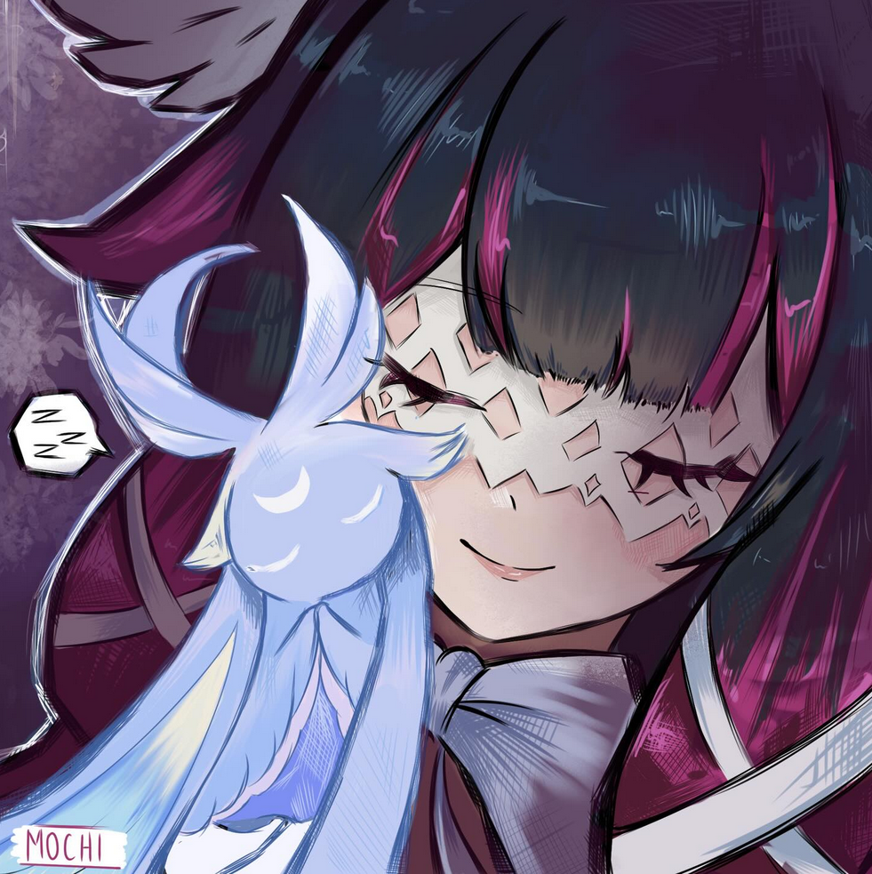

<p align="center">
  
</p>
<p align="center">Simple Web Framework for Hoomans</p>

# ⚠️ This Project Is Not Ready Yet!

- [x] Just start!
- [x] Define the structure and types
- [ ] Implement a TCP server
- [ ] Support for lifecycle events
- [ ] Make a fast JSON parser (maybe (really maybe) use NIFs)
- [ ] Add OpenAPI integration
- [ ] Implement a static code analyzer

# 🧁 Usage

Even Hyposelenia is not ready for production, the API is planned to be simple and feel familiar to other frameworks!
```gleam
let app = hyposelenia()
|> get("/", text("Hello World!"))
|> post("/id/:id", fn(ctx) {
  let id = param(ctx.params, "id")
  response(201, id)
})
listen(app, 300)
```
